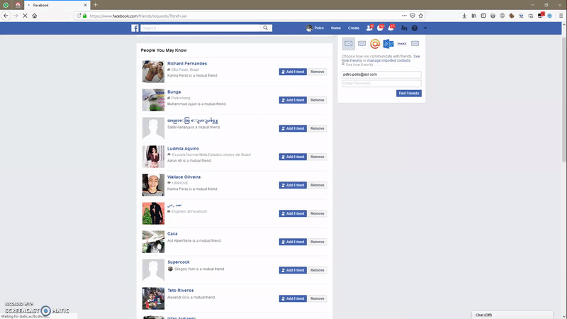
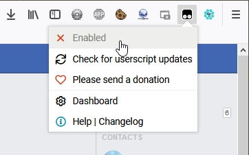
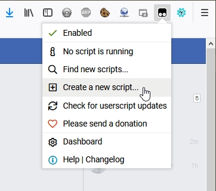
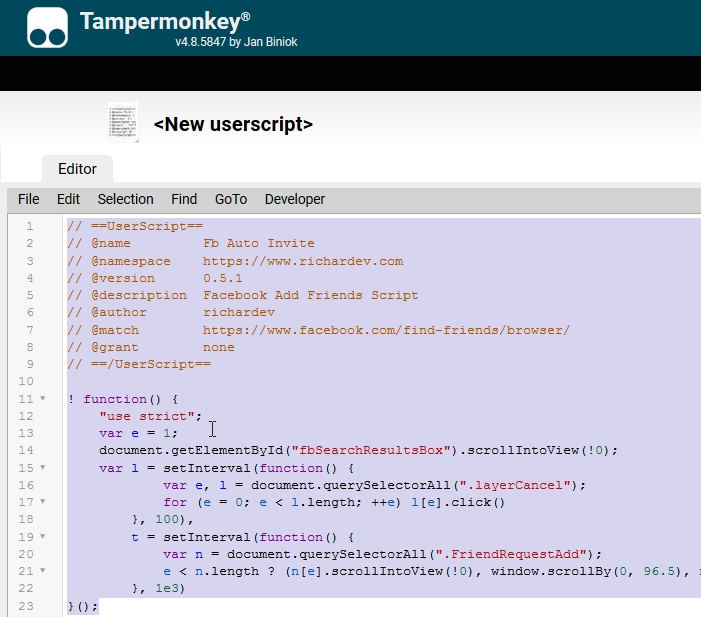

# 😅 For test / study purposes only 
🚧 *We are working for python & headless browser version!* 🚧
# Facebook Auto Add Friends 

  

## How It Works

It's basically Javascript loop that simulates clicks, scrolls page down so the page can load more people into list and if at any point there are any alerts/pop-ups/modals - it listens for them and closes them all. All you need to do is open friends finding page and activate it in Tampermonkey or submit it via Console.

## Usage

### 🅰. With Tampermonkey

1. First, install **Tampermonkey**:
* **Chrome** ───────── [[DOWNLOAD]](https://tampermonkey.net/?ext=dhdg&browser=chrome)
* **Microsoft Edge** ──── [[DOWNLOAD]](https://tampermonkey.net/?ext=dhdg&browser=edge)
* **Safari** ────────── [[DOWNLOAD]](https://tampermonkey.net/?ext=dhdg&browser=safari)
* **Firefox** ───────── [[DOWNLOAD]](https://tampermonkey.net/?ext=dhdg&browser=firefox)
* **Opera Next** ────── [[DOWNLOAD]](https://tampermonkey.net/?ext=dhdg&browser=opera)
* **Dolphin Browser** ─── [[DOWNLOAD]](https://tampermonkey.net/?ext=dhdg&browser=dolphin)
* **UC Browser** ────── [[DOWNLOAD]](https://tampermonkey.net/?ext=dhdg&browser=chrome)

2. **Enable Tampermonkey** by clicking on top right corner icon and selecting **Enable**

  

3. **Add script** by clicking on top right corner icon and selecting **Create a new script...**. When Add New Script window will open simply drag & drop or copy & paste the `fb-add-friends.js` file content.

  

4. **Save script** - while you are still in "Add new script" window, click **File** > **Save**

5. **Open Facebook & Run script**
   5.1. Open `https://www.facebook.com/find-friends/browser/` or `https://www.facebook.com/friends/requests/` URL in Facebook.
   5.2. Click on **Tampermonkey** top right icon and enable **FB Auto Add Friends** by clicling on it (icon must turn green.
   5.3. Reload the page if script not started.

### 🅱. With Browser Console

1. **Open Browser**
2. **Press F12 button** to open Developer Console (key may differ on different browsers)
3. **Open Console tab** and copy code from `fb-add-friends.js` and paste it in console
4. **Hit enter** and let the magic happen!

## ⛔ Attention!!! ⛔

1. Facebook has 1000 invite limitation which means you can only have 1000 pending invitations total.
2. They also compare invitation time differences, so please don't change delay timing to something less than 1 second (1000ms).
3. You should add at least 1-3 people to your friends before running this script so Facebook can Suggest you friends.
